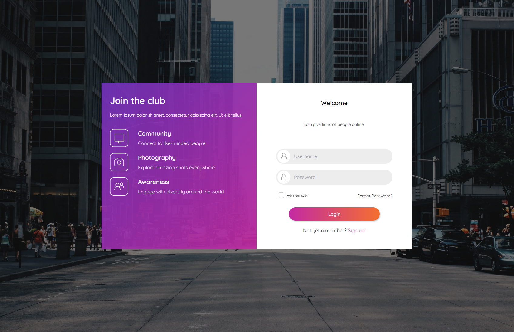

<div style="display: flex; align-content: center; justify-content: center;">
    <h2>SlottyMedia</h2>
    <br/>
    
    <br/>
    <p align="center">
    <br />
    <a href="https://slottyslots.github.io/SlottyMedia"><strong>Documentation »</strong></a>
    </p>
</div>
<br/>
<hr>
<br/>
<details>
<summary>Table of Contents</summary>
<ol>
    <li><a href="#docs">Local Documentation</a></li>
</ol>
</details>
<br/>
<hr>
<h3 id="docs">Local Documentation</h3>
If you want to view the current documentation, you may take a look <a href="https://slottyslots.github.io/SlottyMedia/build/">here</a>

Or run the following commands inside a branch of your desire:

```npm i```

```npm run init```

```cd ./slottymedia-docs ```

```mkdocs serve```

Please make sure you have the installed:

- <a href="https://docs.npmjs.com/downloading-and-installing-node-js-and-npm">Node Package Manager</a> : Needed for initialization scripts (for documentation and development)
- <a href="https://www.python.org/downloads/">Python 3</a> : Needed for Mkdocs (only for documentation)
- <a href="https://dotnet.microsoft.com/en-us/download/dotnet/8.0">.NET 8</a> : Needed to build the project (only development)
- <a href="https://github.com/gitleaks/gitleaks">Gitleaks</a> : Used as a precommit hook to prevent exposure of secrets (only development)
- <a href="https://www.docker.com/">Docker</a> : Needed for running the application locally
- <a href="https://supabase.com/docs/guides/cli/local-development">Supabase CLI</a> : Needed for running the application locally
