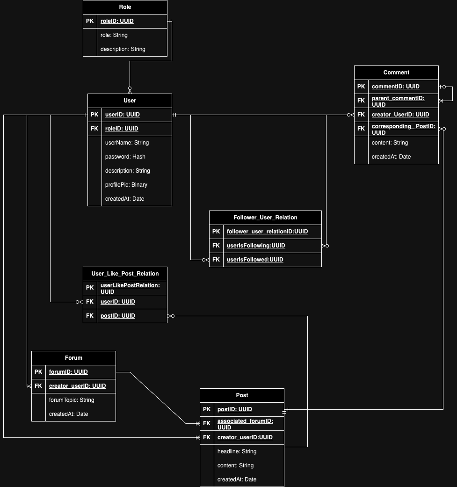

# Database Model

## Entity-Relationship-Diagram

## Table Description

The following tables represent:

- User: Represents a user after its login
- Role: Represents the role of a user e.g. a normal user, or a admin of SlottyMedia
- Forum: The root of any post e.g. a computer science forum providing posts related to computer science
- Post: Posts which may be created under a specific topic (forum)
- Comment: Comments which may be provided by users to a corresponding post (nesting comments e.g. answers on comments may be allowed in the future)
- User_Like_Post_Relation: A linking table which provides information for the like / dislike ratio of a post.
- Follower_User_Relation: A linking table which provided information for the following / follower relation of users

## Featureset

The current database model enables the following featureset:

**Features:**

- A login system (currently still in development)
- Reddit clone: Being able to add a forum with multiple posts and corresponding comments written by any user
- Role management: Being able to add a admin panel for SlottyMedia

