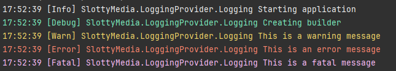

## Logger Implementation 📋

The logger is encapsulated within its own project, named `SlottyMedia.LoggerProvider`. This design ensures that the logger is accessible to all projects within the SlottyMedia ecosystem.

## Logger Targets 🎯

The current implementation of the logger supports two targets: the console and a text file.

### Text File Logging 📄

- **Logging to File:** All log entries are recorded in a text file.
- **Daily Log Files:** A new log file is created each day.
- **Archiving:** The previous day's log file is moved to the archives folder and retained for 30 days before being deleted.
- **Storage Location:** Log files are stored in the `logs` folder within the directory where the SlottyMedia project is executed.

### Console Logging 🖥️

- **Log Levels:** Logs from `Debug` to `Fatal` levels are output to the console.
- **Exclusions:** Microsoft logs below the `Warn` level are not logged to the console.
- **Color Scheme:** The console output uses a defined color scheme for quicker log identification.



## Base Exception ❗

To centralize exception logging, a single `BaseException` class is implemented within the `LoggingProvider` project. This class automatically logs exceptions when they occur.

## Implementing the Logger 🚀

To integrate the logger into your project, follow these steps:

1. **Reference the Logger Project:** Add a reference to `SlottyMedia.LoggingProvider` in your project.
2. **Import the Namespace:** Include the following using directive:

    ```csharp
    using SlottyMedia.LoggingProvider;
    ```

3. **Get the Logger Instance:** Retrieve the logger instance with the following code:

    ```csharp
    Logging<Program> logger = new ();
    ```
    
4. **Use LogLevel Methods:** Utilize the logger instance to call the various log level methods as needed.


[Implementation](code/SlottyMedia.LoggingProvider/slottymedia.loggingprovider.logging-1.md)


[Configuration](code/SlottyMedia.LoggingProvider/slottymedia.loggingprovider.nlogconfiguration.md)